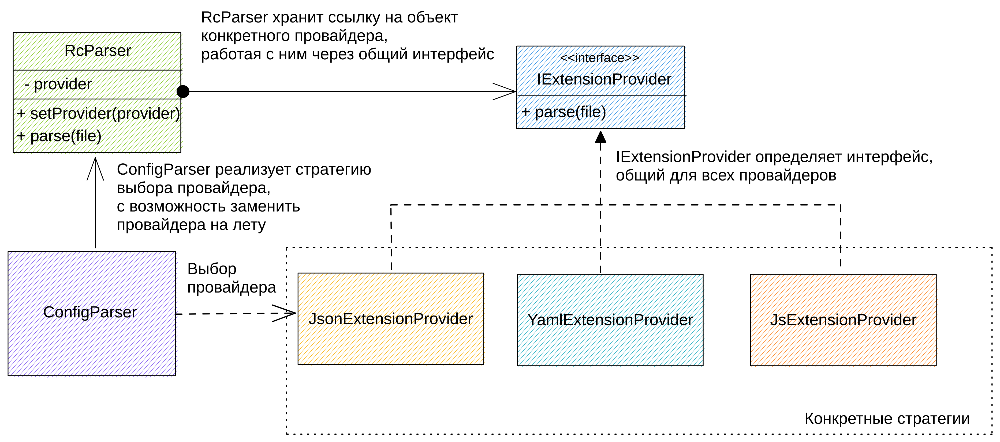

# Архитектура проекта

## Статус

*Какой статус, такой как предлагаемый (proposed), принятый (accepted), отклоненный(rejected), устаревший (deprecated), заменен (superseded) и т.д.?*

2023-05-08 предлагаемый

## Контекст

*Какая проблема мотивирует это решение или изменение?*

Нужна библиотека, которая позволит парсить runtime config различных расширений: json, yaml, js/ts и др. Т.е. будут встроенные провайдеры расширений(json, yaml, js/ts), но должна иметься возможность переопределить встроенные и добавить новые провайдеры в случаи необходимости.

Примеры файлов.

- .testrc.json
- .testrc.yaml/testrc.yml
- .testrc.js/testrc.ts
- .testrc (для этого файла должен быть прописан формат, по дефолту - json)

Подробнее:

1. При этом в конфиге либы должна быть возможность прописать путь к папке, где будут хранится rc файлы (по дефолту корень проекта).
2. Возможность задать префикс (по дефолту - `.`), название конфига (по дефолту - это обязательный параметр, если нет - выкинуть исключение) и суффикс (по дефолту - `rc`).
3. Задать дефолтный приоритет, выбора для парсинга (общий случай, если есть все типы файлов):
   1. .*rc.ts
   2. .*rc.js
   3. .*rc.json
   4. .*rc.yaml
   5. .*rc.yml
   6. .*rc
   7. остальные расширения (для них очередность указывается в конфиге на стороне проекта)
4. Возможность выбрать какие расширения будет поддерживать проект, использующий данную либу, а также прописать их приоритет.
5. Возможность добавить новые расширения провайдеров
   например: он хочет хранить конфиги в xml, ini или в любом другом формате.
   P.S. если будет необходимость эти или другие форматы могу попасть в следующий релиз.
6. Возможность переопределить старые провайдеры
   например: вышла более эффективная либа для парсинга yaml, пользователь, решил переопределить провайдер и проверить эффективность.
   Или ему срочно нужна именно эта либа в проекте и он не хочет ждать пока PR одобрят.

## Решение

*Какое изменение мы предлагаем и/или делаем?*

### Архитектура решения

Т.к. нужно иметь возможность выбирать провайдер, и расширять новыми провайдерами из вне, то имеет смысл использовать паттерн стратегия.

Вот общий вид, предлагаемой архитектуры:

### Провайдеры расширений

1. ts/js можно использовать [dynamic import for ts](https://www.typescriptlang.org/docs/handbook/release-notes/typescript-2-4.html#dynamic-import-expressions) нужно проверить этот момент для ts/js
2. json можно использовать `JSON.parse()`
3. yaml/yml можно использовать [yaml](https://www.npmjs.com/package/yaml)
4. без расширения, по дефолту json, но можно поменять на любой встроенный или назначить новый провайдер.

## Последствия

*Что становится проще или труднее сделать из-за этого изменения?*

1. Т.к. было решено yaml провайдер реализовать в первой версии, то это означает, что  либа  будет содержать 1 доп зависимость.
2. Паттерн стратегия позволит понятным образом реализовать либу и объяснить принцип работы пользователям, которые будут ее использовать. А также обеспечит понятное API для создания новые провайдеров.
